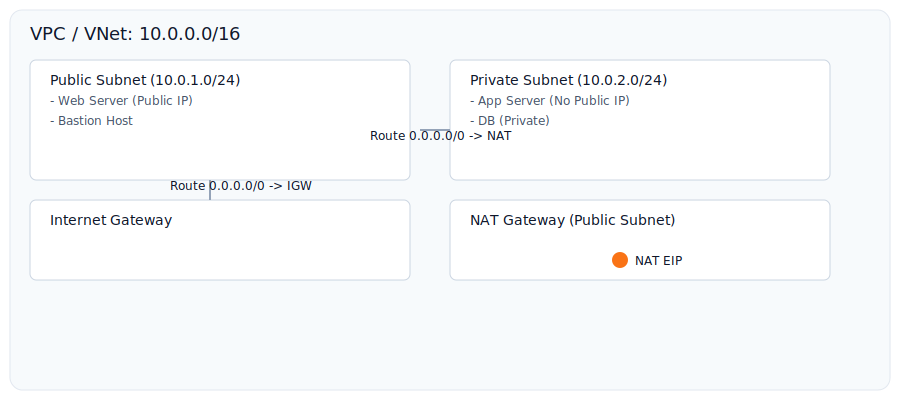

# Diagrams (ASCII) — Use these for video slides or quick diagrams

## Simple VPC with public and private subnets


```
+---------------------------------------------------------+
| VPC 10.0.0.0/16                                         |
|                                                         |
|  +----------------+     +----------------+              |
|  | Public Subnet  |     | Private Subnet |              |
|  | 10.0.1.0/24    |     | 10.0.2.0/24    |              |
|  |  - Web Server  |     |  - App Server  |              |
|  |  - Bastion     |     |  - DB Server   |              |
|  +----------------+     +----------------+              |
|         |                     |                         |
|      IGW/Route             NAT Gateway                   |
|         v                     |                         |
|      Internet <---------------v                        |
+---------------------------------------------------------+
```

## Hub & Spoke


```
           Internet
              |
         Hub VPC/VNet (shared services)
              |
       --------------------
      |         |          |
  Spoke A   Spoke B   Spoke C
  (Apps)     (Dev)      (Prod)

Peering or Transit Gateway connects spokes to hub for shared services (NAT, firewalls, logging).
```

Use these in video slides or show them as text diagrams in the video and blog. You can swap in the `./images/*.svg` files for high-quality slides.